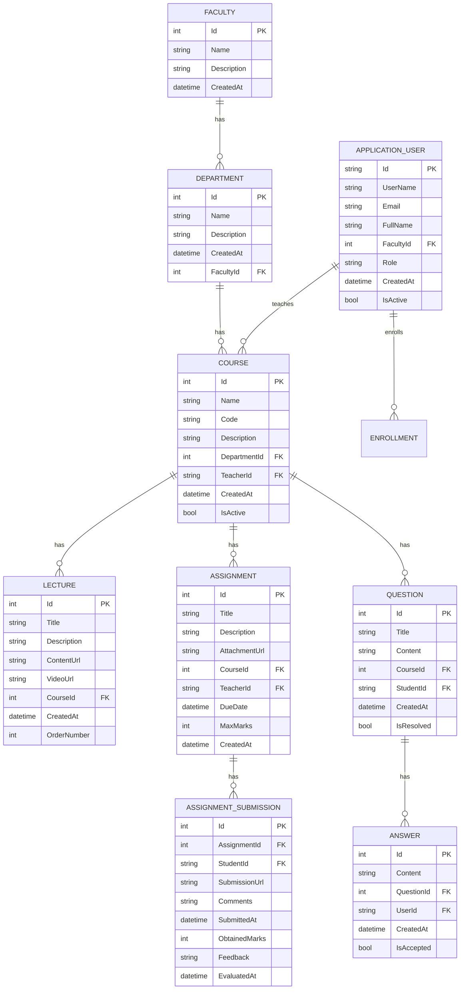

# 📊 PBLC System Diagrams

এই ডকুমেন্টে PBLC (Problem-Based Learning Center) সিস্টেমের ফরমাল ডায়াগ্রাম গুলো আছে।

---

## 📦 Table of Contents

1. [Class Diagram](#class-diagram) - Object-Oriented View
2. [ER Diagram](#er-diagram) - Database View
3. [How to Export as PNG/PDF](#how-to-export-as-pngpdf)

---

## 🎯 Class Diagram

**Purpose:** সিস্টেমের সব entities এবং তাদের relationships দেখায় (Object-Oriented Perspective)

**Format:** Standard UML - Attributes (উপরে) + Methods (নিচে)

```mermaid
classDiagram
    direction TB

    class ApplicationUser {
        +string Id
        +string UserName
        +string Email
        +string FullName
        +UserRole Role
        +int? FacultyId
        +DateTime CreatedAt
        +bool IsActive
        ---
        +Login()
        +Register()
        +UpdateProfile()
        +ChangePassword()
    }

    class Faculty {
        +int Id
        +string Name
        +string Description
        +DateTime CreatedAt
        ---
        +AddFaculty()
        +UpdateFaculty()
        +DeleteFaculty()
        +GetDepartments()
    }

    class Department {
        +int Id
        +string Name
        +string Description
        +DateTime CreatedAt
        +int? FacultyId
        ---
        +AddDepartment()
        +UpdateDepartment()
        +DeleteDepartment()
        +GetCourses()
    }

    class Course {
        +int Id
        +string Name
        +string Code
        +string Description
        +int DepartmentId
        +string TeacherId
        +DateTime CreatedAt
        +bool IsActive
        ---
        +CreateCourse()
        +UpdateCourse()
        +DeleteCourse()
        +EnrollStudent()
        +GetEnrolledStudents()
        +GetLectures()
        +GetAssignments()
    }

    class Lecture {
        +int Id
        +string Title
        +string Description
        +string ContentUrl
        +string VideoUrl
        +int CourseId
        +DateTime CreatedAt
        +int OrderNumber
        ---
        +UploadLecture()
        +UpdateLecture()
        +DeleteLecture()
        +DownloadContent()
    }

    class Assignment {
        +int Id
        +string Title
        +string Description
        +string AttachmentUrl
        +int CourseId
        +string TeacherId
        +DateTime DueDate
        +int MaxMarks
        +DateTime CreatedAt
        ---
        +CreateAssignment()
        +UpdateAssignment()
        +DeleteAssignment()
        +GetSubmissions()
    }

    class AssignmentSubmission {
        +int Id
        +int AssignmentId
        +string StudentId
        +string SubmissionUrl
        +string Comments
        +DateTime SubmittedAt
        +int? ObtainedMarks
        +string Feedback
        +DateTime? EvaluatedAt
        ---
        +SubmitAssignment()
        +UpdateSubmission()
        +Evaluate()
        +ProvideFeedback()
    }

    class Question {
        +int Id
        +string Title
        +string Content
        +int CourseId
        +string StudentId
        +DateTime CreatedAt
        +bool IsResolved
        ---
        +AskQuestion()
        +UpdateQuestion()
        +DeleteQuestion()
        +MarkAsResolved()
        +GetAnswers()
    }

    class Answer {
        +int Id
        +string Content
        +int QuestionId
        +string UserId
        +DateTime CreatedAt
        +bool IsAccepted
        ---
        +PostAnswer()
        +UpdateAnswer()
        +DeleteAnswer()
        +MarkAsAccepted()
    }

    %% Relationships
    Faculty "1" --> "0..*" Department : has
    Department "1" --> "0..*" Course : contains
    ApplicationUser "1" --> "0..*" Course : teaches
    ApplicationUser "0..*" --> "0..*" Course : enrolls in
    Course "1" --> "0..*" Lecture : has
    Course "1" --> "0..*" Assignment : has
    Course "1" --> "0..*" Question : has
    Assignment "1" --> "0..*" AssignmentSubmission : receives
    ApplicationUser "1" --> "0..*" AssignmentSubmission : submits
    Question "1" --> "0..*" Answer : has
    ApplicationUser "1" --> "0..*" Answer : writes
    ApplicationUser "0..*" --> "0..1" Faculty : belongs to
```



### Class Diagram Summary

**Total Classes:** 9

**Structure:**
- **Top Section:** Attributes/Variables (Properties with data types)
- **Separator:** `---` line
- **Bottom Section:** Methods/Operations (Functions)

**Key Relationships:**
- `Faculty` → `Department` (1:Many)
- `Department` → `Course` (1:Many)
- `Course` → `Lecture`, `Assignment`, `Question` (1:Many each)
- `Assignment` → `AssignmentSubmission` (1:Many)
- `Question` → `Answer` (1:Many)
- `ApplicationUser` → Multiple entities (Teacher, Student roles)

---

## 🗄️ ER Diagram

**Purpose:** ডাটাবেস স্ট্রাকচার দেখায় Primary Keys, Foreign Keys এবং Table Relationships সহ



### ER Diagram Summary

**Total Tables:** 9

**Primary Keys:** All tables have `Id` as PK (except `APPLICATION_USER` which uses `string Id`)

**Foreign Keys:**
- `DEPARTMENT.FacultyId` → `FACULTY.Id`
- `APPLICATION_USER.FacultyId` → `FACULTY.Id`
- `COURSE.DepartmentId` → `DEPARTMENT.Id`
- `COURSE.TeacherId` → `APPLICATION_USER.Id`
- `LECTURE.CourseId` → `COURSE.Id`
- `ASSIGNMENT.CourseId` → `COURSE.Id`
- `ASSIGNMENT.TeacherId` → `APPLICATION_USER.Id`
- `ASSIGNMENT_SUBMISSION.AssignmentId` → `ASSIGNMENT.Id`
- `ASSIGNMENT_SUBMISSION.StudentId` → `APPLICATION_USER.Id`
- `QUESTION.CourseId` → `COURSE.Id`
- `QUESTION.StudentId` → `APPLICATION_USER.Id`
- `ANSWER.QuestionId` → `QUESTION.Id`
- `ANSWER.UserId` → `APPLICATION_USER.Id`

---

## 📤 How to Export as PNG/PDF

### Method 1: Using VS Code + Mermaid Extension (Recommended)

1. **Install Extension:**
   - Install "Markdown Preview Mermaid Support" extension in VS Code

2. **Open Preview:**
   - Open this file (`DIAGRAMS.md`)
   - Press `Ctrl+Shift+V` to open preview

3. **Export to HTML:**
   - Right-click in preview → "Open in Browser"
   - Browser থেকে "Print" → "Save as PDF"

### Method 2: Using Online Mermaid Editor

1. **Visit:** https://mermaid.live/
2. **Copy Diagram Code:**
   - উপরের যেকোনো ডায়াগ্রামের কোড কপি করুন (শুধু mermaid ব্লকের ভিতরের অংশ)
3. **Paste & Export:**
   - Editor এ পেস্ট করুন
   - "PNG" বা "SVG" বাটনে ক্লিক করে ডাউনলোড করুন

### Method 3: Using Mermaid CLI (Advanced)

```powershell
# Install Mermaid CLI
npm install -g @mermaid-js/mermaid-cli

# Export Class Diagram
mmdc -i docs/class-diagram.md -o diagrams/class-diagram.png

# Export ER Diagram
mmdc -i docs/er-diagram.md -o diagrams/er-diagram.png
```

### Method 4: Screenshot (Quick & Easy)

1. VS Code এ preview open করুন (`Ctrl+Shift+V`)
2. Windows Snipping Tool (`Win+Shift+S`) দিয়ে screenshot নিন
3. PNG হিসেবে save করুন

---

## 📋 Quick Reference

| Diagram Type | Purpose | Best For |
|--------------|---------|----------|
| **Class Diagram** | Shows entities, properties, relationships | Understanding system architecture |
| **ER Diagram** | Shows database tables, keys, relationships | Database design & documentation |

---

## 📁 File Locations

- **This Combined File:** `DIAGRAMS.md`
- **Separate Class Diagram:** `docs/class-diagram.md`
- **Separate ER Diagram:** `docs/er-diagram.md`
- **Technical Details:** `PROJECT_TECHNICAL_DETAILS.md`

---

**Generated:** October 20, 2025  
**Project:** PBLC (Problem-Based Learning Center)  
**Technology Stack:** ASP.NET Core 9.0 + MySQL 8.0 + Entity Framework Core
