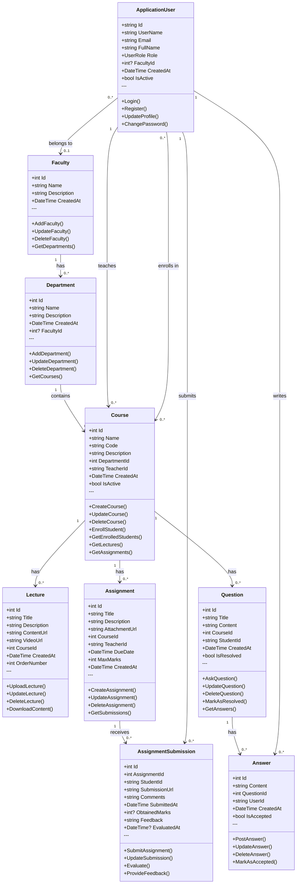

# Class Diagram - PBLC System

Standard UML Class Diagram showing all entities with attributes and methods.

```mermaid
classDiagram
    direction TB

    class ApplicationUser {
        +string Id
        +string UserName
        +string Email
        +string FullName
        +UserRole Role
        +int? FacultyId
        +DateTime CreatedAt
        +bool IsActive
        ---
        +Login()
        +Register()
        +UpdateProfile()
        +ChangePassword()
    }

    class Faculty {
        +int Id
        +string Name
        +string Description
        +DateTime CreatedAt
        ---
        +AddFaculty()
        +UpdateFaculty()
        +DeleteFaculty()
        +GetDepartments()
    }

    class Department {
        +int Id
        +string Name
        +string Description
        +DateTime CreatedAt
        +int? FacultyId
        ---
        +AddDepartment()
        +UpdateDepartment()
        +DeleteDepartment()
        +GetCourses()
    }

    class Course {
        +int Id
        +string Name
        +string Code
        +string Description
        +int DepartmentId
        +string TeacherId
        +DateTime CreatedAt
        +bool IsActive
        ---
        +CreateCourse()
        +UpdateCourse()
        +DeleteCourse()
        +EnrollStudent()
        +GetEnrolledStudents()
        +GetLectures()
        +GetAssignments()
    }

    class Lecture {
        +int Id
        +string Title
        +string Description
        +string ContentUrl
        +string VideoUrl
        +int CourseId
        +DateTime CreatedAt
        +int OrderNumber
        ---
        +UploadLecture()
        +UpdateLecture()
        +DeleteLecture()
        +DownloadContent()
    }

    class Assignment {
        +int Id
        +string Title
        +string Description
        +string AttachmentUrl
        +int CourseId
        +string TeacherId
        +DateTime DueDate
        +int MaxMarks
        +DateTime CreatedAt
        ---
        +CreateAssignment()
        +UpdateAssignment()
        +DeleteAssignment()
        +GetSubmissions()
    }

    class AssignmentSubmission {
        +int Id
        +int AssignmentId
        +string StudentId
        +string SubmissionUrl
        +string Comments
        +DateTime SubmittedAt
        +int? ObtainedMarks
        +string Feedback
        +DateTime? EvaluatedAt
        ---
        +SubmitAssignment()
        +UpdateSubmission()
        +Evaluate()
        +ProvideFeedback()
    }

    class Question {
        +int Id
        +string Title
        +string Content
        +int CourseId
        +string StudentId
        +DateTime CreatedAt
        +bool IsResolved
        ---
        +AskQuestion()
        +UpdateQuestion()
        +DeleteQuestion()
        +MarkAsResolved()
        +GetAnswers()
    }

    class Answer {
        +int Id
        +string Content
        +int QuestionId
        +string UserId
        +DateTime CreatedAt
        +bool IsAccepted
        ---
        +PostAnswer()
        +UpdateAnswer()
        +DeleteAnswer()
        +MarkAsAccepted()
    }

    %% Relationships
    Faculty "1" --> "0..*" Department : has
    Department "1" --> "0..*" Course : contains
    ApplicationUser "1" --> "0..*" Course : teaches
    ApplicationUser "0..*" --> "0..*" Course : enrolls in
    Course "1" --> "0..*" Lecture : has
    Course "1" --> "0..*" Assignment : has
    Course "1" --> "0..*" Question : has
    Assignment "1" --> "0..*" AssignmentSubmission : receives
    ApplicationUser "1" --> "0..*" AssignmentSubmission : submits
    Question "1" --> "0..*" Answer : has
    ApplicationUser "1" --> "0..*" Answer : writes
    ApplicationUser "0..*" --> "0..1" Faculty : belongs to
```
