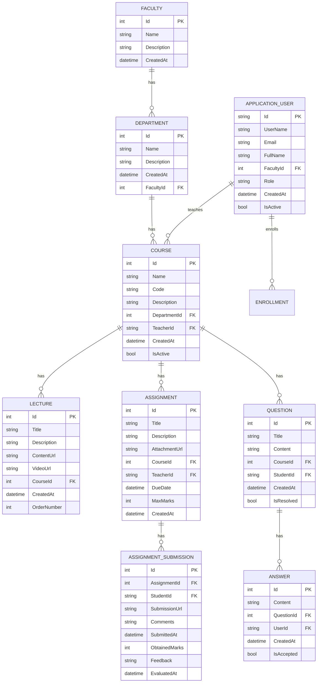

# ER Diagram (Mermaid)

```mermaid
erDiagram
    FACULTY ||--o{ DEPARTMENT : has
    DEPARTMENT ||--o{ COURSE : has
    APPLICATION_USER ||--o{ COURSE : teaches
    APPLICATION_USER ||--o{ ENROLLMENT : enrolls
    COURSE ||--o{ LECTURE : has
    COURSE ||--o{ ASSIGNMENT : has
    ASSIGNMENT ||--o{ ASSIGNMENT_SUBMISSION : has
    COURSE ||--o{ QUESTION : has
    QUESTION ||--o{ ANSWER : has

    FACULTY {
        int Id PK
        string Name
        string Description
        datetime CreatedAt
    }

    DEPARTMENT {
        int Id PK
        string Name
        string Description
        datetime CreatedAt
        int FacultyId FK
    }

    APPLICATION_USER {
        string Id PK
        string UserName
        string Email
        string FullName
        int FacultyId FK
        string Role
        datetime CreatedAt
        bool IsActive
    }

    COURSE {
        int Id PK
        string Name
        string Code
        string Description
        int DepartmentId FK
        string TeacherId FK
        datetime CreatedAt
        bool IsActive
    }

    LECTURE {
        int Id PK
        string Title
        string Description
        string ContentUrl
        string VideoUrl
        int CourseId FK
        datetime CreatedAt
        int OrderNumber
    }

    ASSIGNMENT {
        int Id PK
        string Title
        string Description
        string AttachmentUrl
        int CourseId FK
        string TeacherId FK
        datetime DueDate
        int MaxMarks
        datetime CreatedAt
    }

    ASSIGNMENT_SUBMISSION {
        int Id PK
        int AssignmentId FK
        string StudentId FK
        string SubmissionUrl
        string Comments
        datetime SubmittedAt
        int ObtainedMarks
        string Feedback
        datetime EvaluatedAt
    }

    QUESTION {
        int Id PK
        string Title
        string Content
        int CourseId FK
        string StudentId FK
        datetime CreatedAt
        bool IsResolved
    }

    ANSWER {
        int Id PK
        string Content
        int QuestionId FK
        string UserId FK
        datetime CreatedAt
        bool IsAccepted
    }
```
